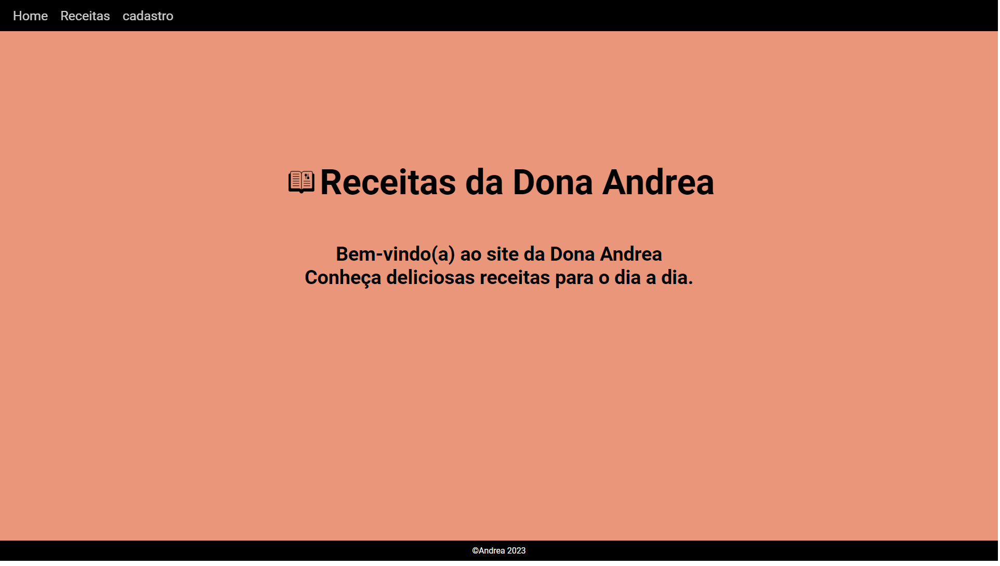
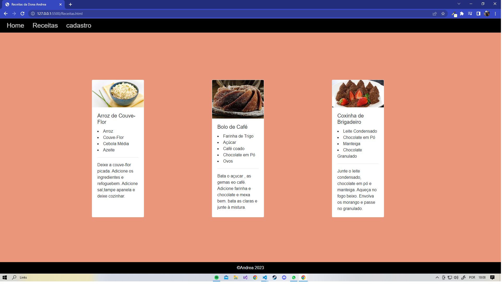

# Missao-pratica-Nivel1-Mundo2-Receitas
 
 <table>
  <tr>
    <td align="center">
         
    </td>
</tr>
</table>
 
  <table>
  <tr>
    <td align="center">
        
    </td>
</tr>
</table>

  <table>
  <tr>
    <td align="center">
        
    </td>
</tr>
</table>

##  🚀 Tecnologias

Esse projeto foi desenvolvido com as seguintes tecnologias:

- HTML
- CSS
- BOOTSTRAP

##  💻 Projeto

Projeto desenvolvido para Nivel 1 do mundo 2.
Desenvolvimento Full stak Estácio.

##🤝 Colaboradores

<table>
  <tr>
    <td align="center">
      <a href="#">
         
        
          <b>Eudes Barbosa</b>
        
      </a>
    </td>
</tr>
</table>
 

[ ⬆ Voltar ao topo ](#Origin-six) 